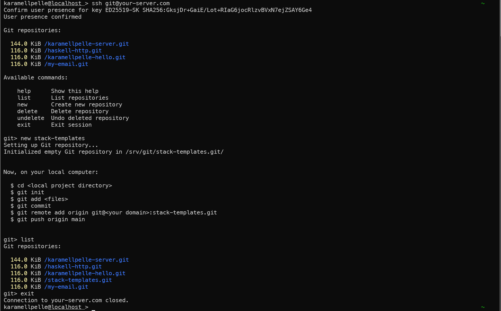

# karamellpelle-git-server

Simple tools to manage your own Git server (create, list and delete/undelete repositories).

## Prerequisites
* A server running a configured SSH daemon
* [gdu](https://github.com/dundee/gdu)
* ...and probably some more like Python stuff for this dotbot project to work

## Install
On your server:
~~~bash
# make sure you pick a directory to clone into, like `cd ~/Source`
$ git clone https://github.com/karamellpelle/karamellpelle-git-server.git && cd karamellpelle-git-server && ./install
~~~

## Setup

This follows the guide from the [Git book](https://git-scm.com/book/en/v2/Git-on-the-Server-Setting-Up-the-Server).

* Create a Git user on your server, and add your public keys for authentication to `/home/git/.ssh/authorized_keys`.
* Create the `/srv/git/` folder on your server and give ownership to the _git_ user:
  ~~~bash
  $ mkdir -p /srv/git
  $ sudo chown git: /srv/git
  ~~~
* Setup _git-shell_ as the login shell for the _git_ user:
  ~~~bash
  # see if git-shell is registered...
  $ cat /etc/shells
  # ...and add if not present:
  $ which git-shell
  $ sudoedit /etc/shells
  # change to git-shell for the git user
  $ sudo chsh git -s $(which git-shell)
  ~~~

## Usage

Now, from you local computer: ssh into your server: `ssh git@<your domain>` (maybe add custom flags like port (`-p <num>`) or key (`-i ~/.ssh/<key id>`)) and enjoy your Git server 🤗

## TODO

Probably 🤔

## Screenshots

